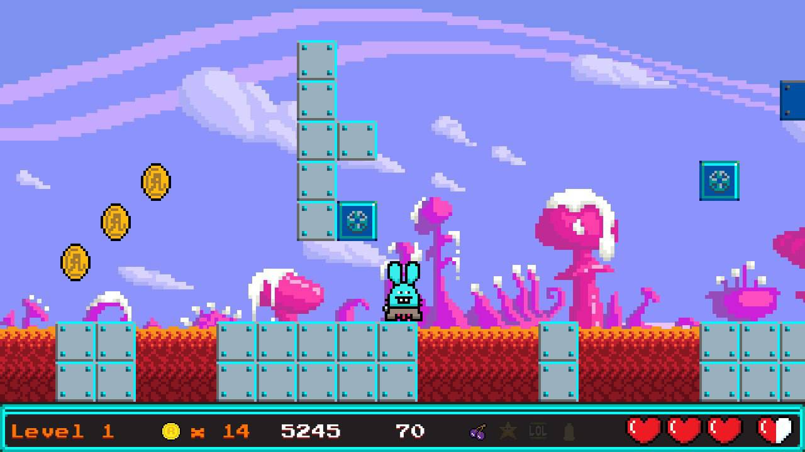

# Introduction 

Hoppa is a 2D Classic Platform game in arcade style developed and published by Moonshot & Ra8bits. 

# License

All media released as CC BY-SA 4.0
All sources released as MIT open source 

# Join us!

Contributions welcome!

# Getting started

Usage:

```
$ npm install
$ npm run start

$ npm run build
```

# Metamask integration

If you have Metamask installed, the game will attempt to check your Moonshot and Ra8it balance and allow you access to Level 2 and above if you have more than 0 tokens.

# Dependencies

To create levels, you need Tiled ( https://www.mapeditor.org ) 


# Screenshots:




