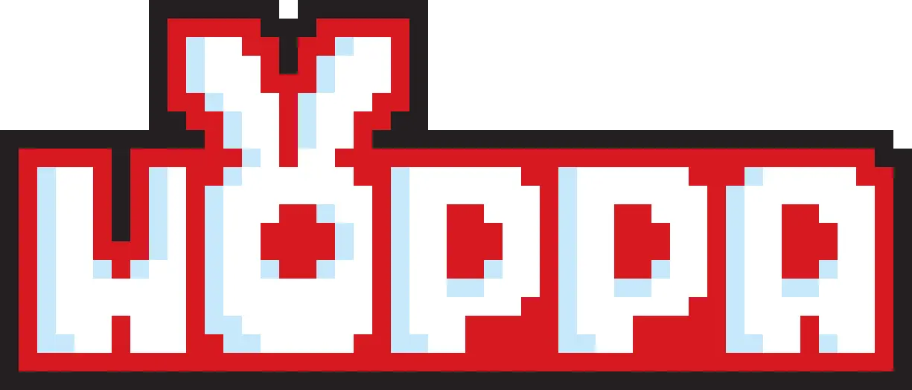
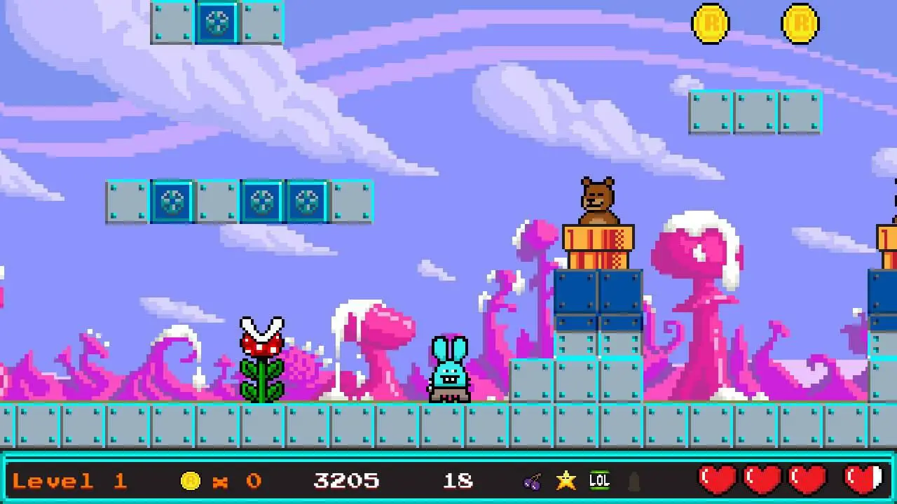
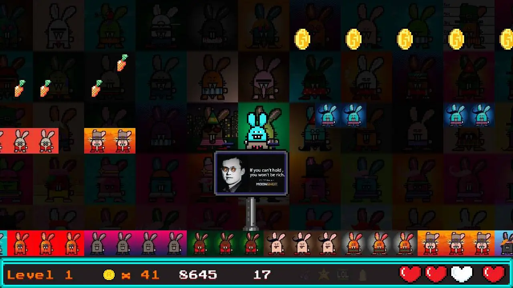
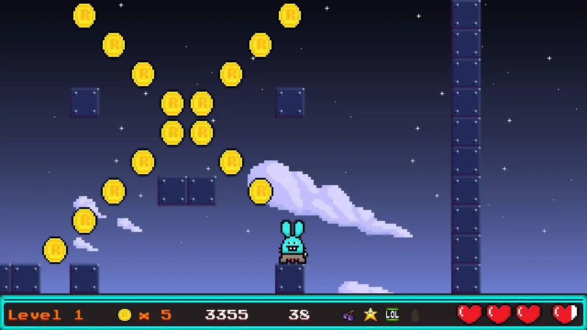

# Introduction 

Hoppa is a 2D Classic Platform game in arcade style developed and published by Moonshot & Ra8bits. 

# Storyline

"When a Ra8bit is denied to live the life he believes in, he has no other choice but to become an outlaw”

It is dark and cold on the moon… you could hear a pin drop, if you had one. 
There’s this box and when you get closer, squeaky noises are coming from inside. 
"Ra8bit…brap, Ra8bit! Fukkie, toot, tootfukkie! Ra8bit…many pew, poing!"

What the f….?! They’ve landed! They’re on the moon! 
The first Ra8bit ever on the moon! Do you hear thát Miss Baker!?
They totally lost control in a way that resulted in 10.000 NFT Male Ra8bits.

Now they are eager to meet some girls!
Ra8bit is on a journey to reproduce motherfuckers!
Take a carrot and head to the lobby, it starts right here!

Pick up your balls and go get the ladies in distress.
The reward is greater than the risk here!

Find the Ra8bithole, Ra8bits very own breedingroom!

# Running

You can install this game as PWA or play it in a modern browser

# License

All media released as CC BY-SA 4.0
All sources released as MIT open source 

# Join us!

Contributions welcome!

Have a chat!

- https://t.me/MoonShotChat
- https://t.me/ra8bits


# Getting started

Usage:

```
$ npm install
$ npm run start
```

To create a production build:

```
npm run build
```

Production files will be placed in the `dist` folder. Then upload those files to a web server. 🎉


## Project Structure

```
    .
    ├── dist
    ├── node_modules
    ├── public
    ├── src
    │   ├── scripts/
    │   ├── scenes/
    │   ├ main.ts
	├── index.html
    ├── package.json
```

## Static Assets

Any static assets like images or audio files must be placed in the `public/assets` folder.

```
    public
    ├── assets
    │   ├── my-image.webp
```

Images must be in webp format
Audio files must be in mp3 and in m4a format

# Way of the code

- Refactor when needed
- Try out things first
- Discover what you need
- Iterate often
- Throw things away and replace

# Metamask integration

If you have Metamask installed, the game will attempt to check your Moonshot and Ra8it balances and allow you access to Level 2 and above if you have more than 0 tokens or more than 0 NFTs.


# Dependencies

To edit/create levels, you need Tiled ( https://www.mapeditor.org ) 


# Screenshots:

Level 1


Bonus Level


Level 1


Secret Room

